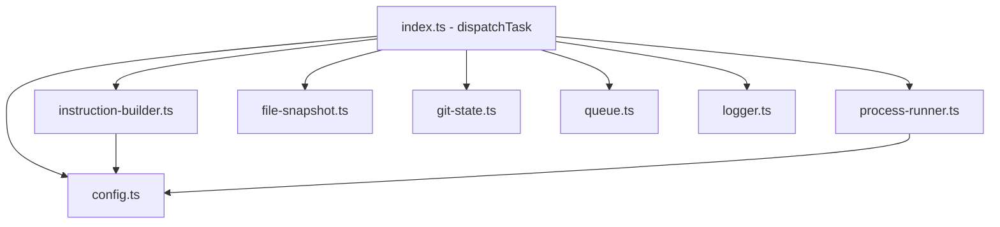

# Design Document: Rayu Worker Agent

## Overview

The Rayu Worker Agent feature introduces a **Task_Dispatcher** module that enables Kiro to delegate coding tasks to Rayu Code — an external AI coding agent — by spawning it as a child process via CLI. The module handles the full lifecycle: formatting structured instructions, spawning the process, collecting results, managing concurrency, and logging invocations.

The Task_Dispatcher is a pure server-side TypeScript module with no React dependencies. It lives under `src/server/rayu/` following the project's convention of server-side modules in `src/server/`. It uses Node.js `child_process` APIs exclusively and has no external runtime dependencies beyond the Node.js standard library.

### Design Decisions

1. **Module placement**: `src/server/rayu/` — parallel to `src/server/dal/` and `src/server/liveblocks.ts`. This is a server-only concern; no client code touches it.
2. **No new dependencies**: Uses only Node.js built-in modules (`child_process`, `fs/promises`, `path`, `crypto`). No third-party queue library — the concurrency model is simple enough (one process per workspace) to implement in-process.
3. **Pure core functions**: Instruction formatting, result parsing, and configuration validation are pure functions (inputs in, outputs out) — testable without spawning processes, matching the pattern of `element-sync.ts`.
4. **Filesystem-based logging**: JSON Lines to `.kiro/logs/rayu-sessions.log` — no database dependency, no new migration.
5. **No automatic retry**: The Task_Dispatcher reports results; Kiro (the orchestrator) decides whether to retry. This keeps the module simple and avoids policy decisions at the wrong layer.


## Architecture

### Module Structure

```
src/server/rayu/
├── index.ts                 # Public API: dispatchTask()
├── types.ts                 # TypeScript interfaces (TaskInstruction, TaskResult, Config)
├── config.ts                # Configuration loading and validation
├── instruction-builder.ts   # Task instruction formatting (pure)
├── process-runner.ts        # child_process spawn + stream collection
├── file-snapshot.ts         # Before/after file change detection (pure logic)
├── git-state.ts             # Git HEAD, diff, working tree status
├── queue.ts                 # Per-workspace concurrency control
├── logger.ts                # JSON Lines log writer with rotation
└── __tests__/
    ├── config.test.ts
    ├── instruction-builder.test.ts
    ├── file-snapshot.test.ts
    ├── queue.test.ts
    └── process-runner.test.ts
```

### Dependency Graph



### Key Architectural Principles

- **No DAL dependency**: This module does not call Prisma or interact with the database. It operates purely on the filesystem and child processes.
- **No network access**: The Task_Dispatcher itself makes no outbound network calls. Rayu Code inherits env vars but the dispatcher does not open connections.
- **Stateless between invocations**: The only persistent state is the log file. The queue is in-memory and resets on process restart (acceptable — tasks are short-lived).
- **Fail-open for non-critical paths**: Logging failures never block execution. Git integration failures degrade gracefully (skip git data, note in result).


## Components and Interfaces

### Core TypeScript Interfaces (`types.ts`)

```typescript
/** Structured task instruction sent to Rayu Code via stdin */
export interface TaskInstruction {
  /** Human-readable description of what Rayu should do */
  description: string;
  /** File paths relevant as context (will be read and included) */
  contextFiles: string[];
  /** Rules/conventions the agent must follow */
  constraints: string[];
  /** File paths Rayu is permitted to create or modify (1-50 entries) */
  permittedFiles: string[];
  /** Description of expected output artifacts */
  expectedOutput: string;
  /** Optional: environment variables to pass (beyond inherited) */
  envOverrides?: Record<string, string>;
}

/** Result returned after Rayu Code execution completes */
export interface TaskResult {
  /** Process exit code (0 = success, -1 = timeout) */
  exitCode: number;
  /** Captured stdout (truncated to last 100KB if exceeded) */
  stdout: string;
  /** Captured stderr (truncated to last 100KB if exceeded) */
  stderr: string;
  /** Files created or modified during execution */
  filesChanged: FileChange[];
  /** Execution duration in milliseconds */
  durationMs: number;
  /** Whether stdout/stderr were truncated */
  truncated: { stdout: boolean; stderr: boolean };
  /** Failure classification (null if exitCode === 0) */
  failureClass: "retriable" | "non-retriable" | null;
  /** Files modified outside the permitted list */
  unauthorizedChanges: string[];
  /** Git state before/after (null if not a git repo) */
  gitInfo: GitInfo | null;
  /** Lint errors if workspace defines pnpm lint */
  lintErrors: LintError[] | null;
}

export interface FileChange {
  path: string;
  type: "created" | "modified";
}

export interface GitInfo {
  /** HEAD commit hash before execution */
  preHeadHash: string;
  /** Working tree status before execution */
  preWorkingTree: GitFileStatus[];
  /** Unified diff of all changes relative to pre-HEAD */
  diff: string;
  /** Warning if pre-existing uncommitted changes existed */
  dirtyWarning: string | null;
}

export interface GitFileStatus {
  path: string;
  status: "modified" | "added" | "deleted" | "untracked";
}

export interface LintError {
  file: string;
  message: string;
}
```


### Configuration Interface (`config.ts`)

```typescript
/** Configuration schema for .kiro/rayu-config.json */
export interface RayuConfig {
  /** Path to the Rayu Code binary (default: "rayu" via PATH) */
  binaryPath: string;
  /** Timeout in seconds (30-3600, default: 300) */
  timeoutSeconds: number;
  /** Max output size in bytes (1024-10485760, default: 102400) */
  maxOutputBytes: number;
  /** Additional CLI flags passed to Rayu (max 20) */
  cliFlags: string[];
  /** Max context injection size in bytes (default: 51200) */
  maxContextBytes: number;
}

/** Partial config as read from JSON file (all fields optional) */
export type RayuConfigFile = Partial<RayuConfig>;

/** Validation result */
export type ConfigResult =
  | { ok: true; config: RayuConfig }
  | { ok: false; error: string };
```

### Public API (`index.ts`)

```typescript
export interface DispatchOptions {
  /** Workspace root directory (must contain package.json with name "liveflows") */
  workspaceDir: string;
  /** The task instruction to send */
  instruction: TaskInstruction;
  /** Optional timeout override in seconds (30-3600) */
  timeoutSeconds?: number;
}

export type DispatchResult =
  | { ok: true; result: TaskResult }
  | { ok: false; error: DispatchError };

export interface DispatchError {
  code:
    | "BINARY_NOT_FOUND"
    | "STARTUP_TIMEOUT"
    | "STDIN_WRITE_FAILED"
    | "WORKSPACE_INVALID"
    | "CONFIG_INVALID"
    | "QUEUE_FULL"
    | "PROCESS_UNKILLABLE";
  message: string;
}

/** Main entry point — dispatches a task to Rayu Code */
export async function dispatchTask(options: DispatchOptions): Promise<DispatchResult>;
```


### Instruction Builder (`instruction-builder.ts`)

Pure function that formats a `TaskInstruction` into the plain-text prompt delivered via stdin:

```typescript
export interface BuildContext {
  instruction: TaskInstruction;
  agentsMdContent: string | null;
  fileContents: Map<string, string>;      // path → content
  missingFiles: string[];                  // referenced but not found
  directoryTree: string | null;           // 2-level deep tree if creation task
  maxContextBytes: number;
}

/** Formats instruction into delimited plain text for Rayu stdin */
export function buildInstructionText(ctx: BuildContext): string;

/** Detects if task description implies file creation */
export function isCreationTask(description: string): boolean;
```

The output format uses `##` markdown heading delimiters for each section:
```
## Project Conventions
{AGENTS.md content}

## Task Description
{description}

## Context Files
### src/server/rayu/types.ts
{file content}

## Constraints
- {constraint 1}
- {constraint 2}

## Permitted Files
- src/server/rayu/new-file.ts
- src/server/rayu/types.ts

## Expected Output
{expected output description}

## Directory Structure
{2-level tree if creation task}
```

### Process Runner (`process-runner.ts`)

```typescript
export interface RunOptions {
  binaryPath: string;
  cliFlags: string[];
  workingDir: string;
  stdinContent: string;
  timeoutMs: number;
  maxOutputBytes: number;
  env: NodeJS.ProcessEnv;
}

export interface RunResult {
  exitCode: number;
  stdout: string;
  stderr: string;
  durationMs: number;
  truncated: { stdout: boolean; stderr: boolean };
  timedOut: boolean;
  unkillable: boolean;
}

/** Spawns CLI process, writes stdin, collects output, enforces timeout */
export function runProcess(options: RunOptions): Promise<RunResult>;
```


### File Snapshot (`file-snapshot.ts`)

Pure functions for before/after file change detection:

```typescript
export interface FileEntry {
  path: string;        // relative to workspace root
  mtimeMs: number;     // last modified timestamp
}

/** Takes a snapshot of file paths + mtimes under workspace (non-recursive gitignore-aware) */
export async function takeSnapshot(workspaceDir: string): Promise<Map<string, number>>;

/** Compares before/after snapshots to determine created and modified files */
export function diffSnapshots(
  before: Map<string, number>,
  after: Map<string, number>,
): FileChange[];

/** Checks which changed files are outside the permitted list */
export function findUnauthorized(
  changes: FileChange[],
  permitted: string[],
): string[];
```

### Queue (`queue.ts`)

```typescript
export interface QueuedTask {
  id: string;
  resolve: (result: DispatchResult) => void;
  execute: () => Promise<DispatchResult>;
}

/** Per-workspace single-concurrency queue with max depth 10 */
export class WorkspaceQueue {
  constructor(private maxDepth: number = 10);

  /** Enqueue a task. Rejects immediately if queue is full. */
  enqueue(workspaceDir: string, execute: () => Promise<DispatchResult>): Promise<DispatchResult>;

  /** Current queue depth for a workspace */
  depth(workspaceDir: string): number;

  /** Whether a task is currently running for this workspace */
  isRunning(workspaceDir: string): boolean;
}
```

### Logger (`logger.ts`)

```typescript
export interface LogEntry {
  timestamp: string;           // ISO 8601 with timezone
  taskDescription: string;     // first 200 chars
  exitCode: number;
  durationMs: number;
  filesChanged: string[];
  errorOutput?: string;        // stderr, last 10,000 chars (only on non-zero exit)
}

/** Appends a JSON Lines entry to the log file, rotating at 10MB */
export async function appendLog(
  logDir: string,
  entry: LogEntry,
): Promise<void>;
```

### Git State (`git-state.ts`)

```typescript
/** Captures git HEAD and working tree status before execution */
export async function capturePreState(workspaceDir: string): Promise<GitInfo | null>;

/** Captures diff after execution, relative to the pre-state HEAD */
export async function captureDiff(
  workspaceDir: string,
  preHeadHash: string,
): Promise<string>;

/** Checks if directory is a valid git repository */
export async function isGitRepo(dir: string): Promise<boolean>;
```


## Data Models

### Configuration File Schema (`.kiro/rayu-config.json`)

```json
{
  "binaryPath": "/usr/local/bin/rayu",
  "timeoutSeconds": 300,
  "maxOutputBytes": 102400,
  "cliFlags": ["--no-interactive"],
  "maxContextBytes": 51200
}
```

**Validation Rules:**
| Field | Type | Range | Default |
|-------|------|-------|---------|
| `binaryPath` | string | non-empty | `"rayu"` (PATH lookup) |
| `timeoutSeconds` | integer | 30–3600 | 300 |
| `maxOutputBytes` | integer | 1024–10485760 | 102400 |
| `cliFlags` | string[] | max 20 items, each non-empty | `[]` |
| `maxContextBytes` | integer | 1024–1048576 | 51200 |

**Environment Variable Overrides:**
| Env Var | Overrides | Format |
|---------|-----------|--------|
| `RAYU_BINARY_PATH` | `binaryPath` | string |
| `RAYU_TIMEOUT` | `timeoutSeconds` | integer string |
| `RAYU_MAX_OUTPUT` | `maxOutputBytes` | integer string |
| `RAYU_CLI_FLAGS` | `cliFlags` | comma-separated |

### Log Entry Schema (`.kiro/logs/rayu-sessions.log`)

Each line is a JSON object:

```json
{
  "timestamp": "2025-01-15T10:30:45.123+08:00",
  "taskDescription": "Create the file-snapshot module with before/after...",
  "exitCode": 0,
  "durationMs": 45230,
  "filesChanged": ["src/server/rayu/file-snapshot.ts"],
  "errorOutput": null
}
```

### File Snapshot Data Structure

In-memory `Map<string, number>` where:
- Key: relative file path (e.g., `src/server/rayu/types.ts`)
- Value: `mtime` in milliseconds (from `fs.stat`)

Collected by recursively walking the workspace, excluding:
- `node_modules/`
- `.next/`
- `.git/` (objects, not working tree)
- Files matching `.gitignore` patterns

### Queue State (in-memory)

```typescript
// Internal structure — not persisted
Map<string, {
  running: Promise<DispatchResult> | null;
  pending: Array<QueuedTask>;
}>
```

Keyed by normalized absolute workspace path. Resets on process restart — acceptable because:
1. Tasks are short-lived (max 3600s)
2. The Next.js server process typically doesn't restart mid-task
3. If it does restart, the spawned Rayu process will still complete independently (orphan cleanup is best-effort)


## Correctness Properties

*A property is a characteristic or behavior that should hold true across all valid executions of a system — essentially, a formal statement about what the system should do. Properties serve as the bridge between human-readable specifications and machine-verifiable correctness guarantees.*

### Property 1: Instruction formatting produces all mandatory sections

*For any* valid `TaskInstruction` with non-empty description, at least one context file, at least one constraint, at least one permitted file, and non-empty expected output, the formatted instruction text SHALL contain exactly the five mandatory section headers (`## Task Description`, `## File Paths`, `## Constraints`, `## Permitted Files`, `## Expected Output`) each appearing exactly once and delimited by the `## ` pattern on its own line.

**Validates: Requirements 2.1, 2.6**

### Property 2: Instruction validation rejects incomplete instructions

*For any* `TaskInstruction` where at least one mandatory field (description, contextFiles, constraints, permittedFiles, expectedOutput) is empty (empty string or empty array), the validation function SHALL reject the instruction and identify the missing section by name.

**Validates: Requirements 2.7**

### Property 3: Permitted files count is bounded

*For any* `TaskInstruction` where the `permittedFiles` array has length 0 or length greater than 50, instruction validation SHALL reject it. For any array with length between 1 and 50 inclusive, validation SHALL accept it (assuming other fields are valid).

**Validates: Requirements 2.3, 6.3**


### Property 4: File snapshot diff correctly detects created and modified files

*For any* two file snapshots (before: `Map<string, number>`, after: `Map<string, number>`), the diff function SHALL report a file as "created" if and only if the path exists in `after` but not in `before`, and as "modified" if and only if the path exists in both maps but the mtime value in `after` is strictly greater than in `before`. Files present only in `before` or with equal mtimes SHALL NOT appear in the result.

**Validates: Requirements 3.3**

### Property 5: Output truncation preserves the last N bytes and prepends a marker

*For any* string content and maximum byte size `M`, if the UTF-8 byte length of the content exceeds `M`, the truncation function SHALL return a result whose total byte length does not exceed `M` plus the marker line length, the result starts with a marker indicating the original byte size, and the result ends with the final `M` bytes of the original content. If the content does not exceed `M`, it SHALL be returned unchanged.

**Validates: Requirements 3.5, 5.5**

### Property 6: Failure classification is deterministic and total

*For any* non-zero integer exit code, the classification function SHALL return exactly one of "retriable" or "non-retriable". Specifically: codes 124 and 137 map to "retriable", codes 126 and 127 map to "non-retriable", and all other non-zero codes map to "retriable". For exit code 0, classification SHALL be null.

**Validates: Requirements 5.1, 5.2, 5.3, 5.4**

### Property 7: Unauthorized file detection identifies exactly the files outside the permitted set

*For any* list of `FileChange` entries and any permitted file list, the `findUnauthorized` function SHALL return exactly those file paths from the changes whose path does not appear in the permitted list. The result SHALL contain no duplicates and no paths that ARE in the permitted list.

**Validates: Requirements 6.4**


### Property 8: Configuration validation rejects out-of-range values and accepts valid ones

*For any* configuration object, if `timeoutSeconds` is outside [30, 3600], or `maxOutputBytes` is outside [1024, 10485760], or `cliFlags` has more than 20 entries, or any flag is an empty string, or `binaryPath` is empty, then validation SHALL return an error identifying the specific field and violated constraint. For any configuration where all fields are within their permitted ranges, validation SHALL return the validated config.

**Validates: Requirements 7.2, 7.5, 7.6, 7.7**

### Property 9: Environment variable overrides take precedence over config file values

*For any* valid config file values and valid environment variable overrides, the resolved configuration SHALL contain the environment variable value for each field where an override is present, and the file value for each field where no override is present.

**Validates: Requirements 7.4**

### Property 10: Context injection respects the byte budget with priority ordering

*For any* combination of AGENTS.md content, referenced file contents, and directory structure whose combined UTF-8 byte size exceeds the configured maximum, the resulting injected context SHALL not exceed the maximum byte budget, SHALL include AGENTS.md content first (truncated only if it alone exceeds the budget), then referenced files in order (each included fully or omitted if no remaining budget), then directory structure (included fully or omitted/truncated). Items omitted or truncated SHALL have lower priority than items fully included.

**Validates: Requirements 8.6, 8.7**

### Property 11: Queue enforces maximum depth and single concurrency per workspace

*For any* sequence of task dispatch calls to the same workspace, the queue SHALL never contain more than 10 pending tasks. If a task is dispatched when the queue is at depth 10, it SHALL be rejected immediately. At most one task SHALL be executing (running) at any time for a given workspace path.

**Validates: Requirements 4.5, 4.6, 4.7**

### Property 12: Log entries are valid JSON Lines with required fields

*For any* completed task invocation (success or failure), the log entry produced SHALL be a valid JSON object containing exactly the fields `timestamp` (ISO 8601 string), `task_description` (string, max 200 characters), `exit_code` (integer), `duration_ms` (non-negative integer), and `modified_files` (array of strings). If `exit_code` is non-zero, the entry SHALL additionally contain `error_output` (string, max 10,000 characters).

**Validates: Requirements 9.1, 9.3, 9.4**


## Error Handling

### Error Categories and Recovery

| Error | Code | Recovery | User Impact |
|-------|------|----------|-------------|
| Binary not found | `BINARY_NOT_FOUND` | Return error immediately | Kiro reports config issue |
| Process startup timeout | `STARTUP_TIMEOUT` | Kill spawn, return error | Kiro may retry or report |
| Stdin write failure | `STDIN_WRITE_FAILED` | Kill process, return error | Kiro may retry with smaller instruction |
| Workspace invalid | `WORKSPACE_INVALID` | Return error before spawn | Kiro reports workspace issue |
| Config parse error | `CONFIG_INVALID` | Return error before spawn | Developer fixes config |
| Queue full | `QUEUE_FULL` | Reject immediately | Kiro waits or reports backpressure |
| Process unkillable | `PROCESS_UNKILLABLE` | Log warning, return error | Manual intervention needed |
| Execution timeout | (exit code -1) | SIGTERM → SIGKILL, return partial result | Kiro classifies as retriable |
| Non-zero exit | (exit code N) | Classify, return full result | Kiro decides retry |
| Log write failure | (non-blocking) | Warn to stderr, continue | No user impact |
| Git command failure | (non-blocking) | Skip git info, note in result | Degraded result, still usable |
| Lint command failure | (non-blocking) | Include partial lint output | Informational only |

### Error Propagation Strategy

1. **Critical errors** (binary missing, workspace invalid, config invalid): Return `DispatchResult` with `ok: false` immediately. Never spawn a process.
2. **Process errors** (timeout, non-zero exit): Return `DispatchResult` with `ok: true` containing a `TaskResult` that has the failure details. The dispatch succeeded (process ran); the task failed.
3. **Peripheral errors** (logging, git, lint): Never block or fail the dispatch. Degrade gracefully — omit the data, note the omission, continue.

### Timeout Sequence

```
t=0        Spawn process
t=timeout  Send SIGTERM
t=timeout+5s  Check if alive → send SIGKILL
t=timeout+10s Check if alive → mark PROCESS_UNKILLABLE error
```

### Concurrency Error Handling

- If a queued task's `execute()` throws unexpectedly (should not happen — all errors are caught internally), the queue drains to the next task. The failed task's promise rejects.
- If the process running for a workspace crashes the Node.js event loop (catastrophic — e.g., segfault in native addon), the queue state is lost. On restart, no tasks are queued. This is acceptable given the short task lifetimes.


## Testing Strategy

### Dual Testing Approach

This feature uses both **unit tests** (example-based, specific scenarios) and **property-based tests** (universal properties across generated inputs). The pure core functions are ideal candidates for property-based testing; the process-spawning and filesystem integration layers use example-based tests with mocks.

### Property-Based Testing

**Library:** [fast-check](https://github.com/dubzzz/fast-check) — the standard PBT library for TypeScript/JavaScript, compatible with Vitest.

**Configuration:**
- Minimum 100 iterations per property test
- Each property test references its design document property number
- Tag format: `Feature: rayu-worker-agent, Property {N}: {property_text}`

**Property tests cover:**

| Module | Properties | Key Generators |
|--------|-----------|----------------|
| `instruction-builder.ts` | P1, P2, P3 | Arbitrary `TaskInstruction` objects with varying field lengths |
| `file-snapshot.ts` | P4, P7 | Arbitrary `Map<string, number>` pairs, arbitrary `FileChange[]` + permitted lists |
| `process-runner.ts` (truncation) | P5 | Arbitrary strings (0–500KB), arbitrary max sizes |
| Error classification | P6 | Arbitrary integers (full int range) |
| `config.ts` | P8, P9 | Arbitrary partial config objects with in-range and out-of-range values |
| `instruction-builder.ts` (context) | P10 | Arbitrary content strings with varying byte lengths |
| `queue.ts` | P11 | Arbitrary sequences of enqueue/dequeue operations |
| `logger.ts` | P12 | Arbitrary `LogEntry` objects |

### Unit Tests (Example-Based)

| Module | Test Focus |
|--------|-----------|
| `config.ts` | Specific known-good and known-bad configs, env var override scenarios |
| `instruction-builder.ts` | Specific formatting output, AGENTS.md inclusion/exclusion, creation-task detection |
| `process-runner.ts` | Mock `child_process.spawn`, verify stdin write, timeout sequence (SIGTERM→SIGKILL), stream capture |
| `file-snapshot.ts` | Real filesystem operations in temp directories |
| `git-state.ts` | Mock `execFile` for git commands, parse `git status --porcelain` output |
| `queue.ts` | Specific ordering, rejection at depth 10, concurrency enforcement |
| `logger.ts` | JSON Lines format, rotation at 10MB, filesystem error handling |
| `index.ts` (integration) | End-to-end with a mock binary (bash script that echoes stdin) |

### Integration Tests

- Spawn a real dummy binary (a shell script) that reads stdin and writes to stdout/stderr
- Verify the full dispatch cycle: instruction → spawn → collect → result
- Test actual file change detection in a temp workspace
- Test git state capture in a temp git repo

### Test File Organization

```
src/server/rayu/__tests__/
├── config.test.ts              # Unit + property tests for config validation
├── instruction-builder.test.ts # Unit + property tests for formatting
├── file-snapshot.test.ts       # Unit + property tests for snapshot diffing
├── process-runner.test.ts      # Unit tests with mocked child_process
├── queue.test.ts               # Unit + property tests for concurrency
├── logger.test.ts              # Unit + property tests for log entries
├── git-state.test.ts           # Unit tests with mocked git commands
├── classification.test.ts     # Property tests for exit code classification
└── integration.test.ts         # End-to-end with dummy binary
```

### Test Commands

```bash
pnpm test -- src/server/rayu/   # Run all rayu tests
pnpm test -- --reporter=verbose src/server/rayu/__tests__/config.test.ts  # Single file
```

### Mocking Strategy

Following the project's existing pattern (see `liveblocks-lifecycle.test.ts`):
- Mock external boundaries only (`child_process`, `fs/promises` for specific tests)
- Test pure functions directly without mocks
- Use `vi.hoisted()` for mocks that need to be available before module imports
- Use real filesystem in temp directories for `file-snapshot.ts` integration tests

