# LiveFlows Delivery Graph — Parallel Agent Orchestration

> **For orchestrators:** This document defines the execution DAG, team charters, and
> interface contracts. It is the coordination layer. Task-level steps live in the
> per-team plan files listed under each team charter.
>
> **REQUIRED SUB-SKILL:** `superpowers:subagent-driven-development` for dispatch,
> `superpowers:using-git-worktrees` for isolation.

**Goal:** Ship LiveFlows MVP 1a to production using five parallel agent teams, with
explicit gates so that no team is blocked by work it does not actually depend on.

**Source spec:** `docs/superpowers/specs/2026-08-08-liveflows-design.md`
**Phase 0 plan:** `docs/superpowers/plans/2026-08-08-liveflows-spikes.md`

---

## 1. The core scheduling insight

Spike 2 — the Excalidraw ↔ Liveblocks round-trip — is permitted to invalidate the
canvas architecture. The naive schedule is therefore *spikes, then everything else*,
which serialises the whole project behind its riskiest unknown.

That is wrong, because **only one track actually depends on Spike 2's outcome.**

| If Spike 2 fails and we fall back to Yjs | Impact |
|---|---|
| Prisma schema | none |
| DAL and authorization | none |
| Clerk auth, orgs, webhooks | none |
| Workspace/project CRUD | none |
| Room lifecycle (create/delete) | none — room ids and permissions are identical |
| CI, deploy, observability | none |
| `storageUpdated` webhook mirror | **partial** — payload shape changes, handler shell survives |
| Canvas reconciliation loop | **total rewrite** |

So the graph gates the canvas track on Spike 2 and lets four other tracks proceed
immediately. Worst case we rewrite one module instead of stalling five teams.

The one genuine hard gate is the **Prisma ESM/CJS decision**, because
`"type": "module"` changes module resolution for `next.config.ts` and Biome — it
touches every team. That is why it is pulled out of Spike 1 and scheduled first,
alone, as node `G0`.

---

## 2. Execution graph

```dot
digraph liveflows {
  rankdir=LR;
  node [shape=box, style=rounded];

  // Gates
  G0 [label="G0: ESM decision\n(HARD GATE — blocks all)", shape=diamond, style=filled, fillcolor="#ffd6d6"];
  G1 [label="G1: Spike 2 verdict\n(gates canvas only)", shape=diamond, style=filled, fillcolor="#fff3cd"];

  // Team Alpha — Foundation & Delivery
  A0 [label="A0: repo tooling\nBiome, Vitest, Playwright"];
  A1 [label="A1: CI pipeline"];
  A2 [label="A2: staging env + deploy"];
  A3 [label="A3: production deploy\n+ observability"];

  // Team Bravo — Canvas & Realtime Core
  B0 [label="B0: Spike 1\nReact Compiler"];
  B1 [label="B1: Spike 2\nround-trip"];
  B2 [label="B2: element-sync\n(promoted, tested)"];
  B3 [label="B3: canvas room\n+ pointer gating"];
  B4 [label="B4: presence\ncollaborators map"];

  // Team Charlie — Data & Identity
  C0 [label="C0: Prisma schema\n+ migrations"];
  C1 [label="C1: DAL\n+ authorization"];
  C2 [label="C2: Clerk setup\nproxy, sign-in/up"];
  C3 [label="C3: Clerk webhooks\n-> Postgres"];

  // Team Delta — Liveblocks Plumbing
  D0 [label="D0: liveblocks-auth\nID tokens"];
  D1 [label="D1: room lifecycle\ncreate / delete"];
  D2 [label="D2: storageUpdated\nmirror webhook"];

  // Team Echo — Product Surface
  E0 [label="E0: app shell\nnav, org switcher"];
  E1 [label="E1: project list\n+ CRUD UI"];
  E2 [label="E2: canvas page\nwiring"];

  // Team Foxtrot — Verification
  F0 [label="F0: E2E harness\nClerk testing"];
  F1 [label="F1: auth + CRUD E2E"];
  F2 [label="F2: two-client\ncollab E2E"];
  F3 [label="F3: production\nsmoke tests"];

  G0 -> A0; G0 -> C0; G0 -> B0;

  A0 -> A1 -> A2 -> A3;
  A0 -> F0;

  B0 -> B1 -> G1;
  G1 -> B2 -> B3 -> B4;

  C0 -> C1 -> E1;
  C2 -> C3; C0 -> C3;
  C2 -> E0; C1 -> D0; C2 -> D0;
  D0 -> D1; C1 -> D1;
  C0 -> D2; D1 -> D2;

  E0 -> E1 -> E2;
  B3 -> E2; D0 -> E2;

  F0 -> F1; C2 -> F1; E1 -> F1;
  B4 -> F2; E2 -> F2; F0 -> F2;

  A1 -> A2 [label="green CI"];
  F1 -> A2 [label="green E2E"];
  F2 -> A3 [label="collab proven"];
  A2 -> F3 -> A3;
}
```



---

## 3. Waves

A wave is a set of nodes with no unmet dependencies. Dispatch every node in a wave
concurrently; wait for the wave to close before opening the next.

| Wave | Nodes | Teams active | Parallelism |
|---|---|---|---|
| **0** | `G0` | Charlie alone | 1 — everything waits |
| **1** | `A0`, `B0`, `C0`, `C2` | Alpha, Bravo, Charlie ×2 | 4 |
| **2** | `A1`, `B1`, `C1`, `C3`, `E0`, `F0` | all six | 6 |
| **3** | `G1`, `D0`, `E1`, `F1` | Bravo, Delta, Echo, Foxtrot | 4 |
| **4** | `B2`, `D1`, `A2` | Bravo, Delta, Alpha | 3 |
| **5** | `B3`, `D2`, `F3` | Bravo, Delta, Foxtrot | 3 |
| **6** | `B4`, `E2` | Bravo, Echo | 2 |
| **7** | `F2` | Foxtrot | 1 |
| **8** | `A3` | Alpha | 1 |

Wave 2 is the peak — six agents, zero file overlap by construction (see § 5).

---

## 4. Team charters

Each team owns files, not features. Ownership is exclusive: if two teams would edit
the same file, that file belongs to one of them and the other consumes an interface.

### Team Alpha — Foundation & Delivery

**Owns:** `biome.json`, `vitest.config.ts`, `playwright.config.ts`,
`.github/workflows/**`, `docker-compose.test.yml`, `next.config.ts`, deployment config

**Nodes:** `A0` tooling · `A1` CI · `A2` staging · `A3` production

**Does not touch:** anything under `src/`

**Plan file:** `docs/superpowers/plans/team-alpha-delivery.md`

Alpha is first to start and last to finish. Its early output unblocks every other
team's ability to run tests, so `A0` is highest priority in Wave 1.

### Team Bravo — Canvas & Realtime Core

**Owns:** `src/features/canvas/**`, `src/spike/**`

**Nodes:** `B0` Spike 1 · `B1` Spike 2 · `B2` element-sync · `B3` canvas room · `B4` presence

**Does not touch:** `src/server/**`, `src/app/api/**`

**Plan file:** `docs/superpowers/plans/team-bravo-canvas.md`

Bravo carries all the architectural risk. `B1` is the single highest-variance task
in the project. Bravo must not be given other work — if `B1` fails, Bravo pivots to
the Yjs fallback and everyone else keeps going.

### Team Charlie — Data & Identity

**Owns:** `prisma/**`, `prisma.config.ts`, `src/server/db.ts`, `src/server/dal/**`,
`src/app/api/webhooks/clerk/**`, `proxy.ts`, `src/app/(auth)/**`

**Nodes:** `G0` ESM decision · `C0` schema · `C1` DAL · `C2` Clerk · `C3` Clerk webhooks

**Does not touch:** `src/features/**`

**Plan file:** `docs/superpowers/plans/team-charlie-data-identity.md`

Charlie owns `G0`, the hard gate. Resolve it, commit it, announce it, then fan out.

### Team Delta — Liveblocks Plumbing

**Owns:** `src/server/liveblocks.ts`, `src/app/api/liveblocks-auth/**`,
`src/app/api/webhooks/liveblocks/**`

**Nodes:** `D0` auth endpoint · `D1` room lifecycle · `D2` mirror webhook

**Does not touch:** `src/features/canvas/**` — Delta owns the server side of
Liveblocks, Bravo owns the client side. The seam is the room id and the Storage shape.

**Plan file:** `docs/superpowers/plans/team-delta-liveblocks.md`

Delta is deliberately independent of Spike 2. Room creation, permissions, and the
webhook shell are identical whether Storage or Yjs wins.

### Team Echo — Product Surface

**Owns:** `src/app/(app)/**`, `src/app/(marketing)/**`, `src/stores/**`,
`src/components/**`

**Nodes:** `E0` shell · `E1` project list + CRUD · `E2` canvas page wiring

**Does not touch:** `src/features/canvas/**`, `src/server/dal/**`

**Plan file:** `docs/superpowers/plans/team-echo-surface.md`

Echo consumes the DAL and renders. It never queries Prisma directly — that rule is
what keeps authorization in one place.

### Team Foxtrot — Verification

**Owns:** `e2e/**`, `src/**/*.test.ts` for cross-cutting suites

**Nodes:** `F0` harness · `F1` auth + CRUD E2E · `F2` collab E2E · `F3` smoke

**Does not touch:** production source. Foxtrot files bugs; owning teams fix them.

**Plan file:** `docs/superpowers/plans/team-foxtrot-verification.md`

Unit tests belong to the team that writes the code. Foxtrot owns E2E and the
cross-team suites only.

---

## 5. File ownership map

This table is the collision-avoidance mechanism. Parallel agents are safe because
no path appears twice.

| Path | Owner |
|---|---|
| `biome.json`, `vitest.config.ts`, `playwright.config.ts` | Alpha |
| `.github/workflows/**`, `docker-compose.test.yml` | Alpha |
| `next.config.ts` | Alpha |
| `prisma/**`, `prisma.config.ts` | Charlie |
| `proxy.ts` | Charlie |
| `src/server/db.ts`, `src/server/dal/**` | Charlie |
| `src/app/(auth)/**`, `src/app/api/webhooks/clerk/**` | Charlie |
| `src/server/liveblocks.ts` | Delta |
| `src/app/api/liveblocks-auth/**` | Delta |
| `src/app/api/webhooks/liveblocks/**` | Delta |
| `src/features/canvas/**`, `src/spike/**` | Bravo |
| `src/app/(app)/**`, `src/app/(marketing)/**` | Echo |
| `src/stores/**`, `src/components/**` | Echo |
| `e2e/**` | Foxtrot |
| `src/generated/prisma/**` | generated — committed by Charlie, read-only to all |

**Shared files, and how they are handled:**

`package.json` is the one unavoidable contention point — five teams add dependencies.
Rule: each team adds its own dependencies in its own commit, and rebases rather than
merges. `pnpm-lock.yaml` conflicts are resolved by discarding the lockfile and
re-running `pnpm install`, never by hand-editing.

`src/app/layout.tsx` is owned by Echo. Charlie needs `<ClerkProvider>` in it —
Charlie specifies the exact JSX in the `C2` handoff and Echo applies it. This is the
only cross-team edit in the plan and it is one file, once.

---

## 6. Interface contracts

Parallel work only functions if each team can code against a signature that does not
exist yet. These are frozen at dispatch. Changing one requires re-dispatching every
consumer.

### Charlie → Echo, Delta (the DAL)

```ts
// src/server/dal/workspaces.ts
export type WorkspaceRef = { id: string; slug: string }

/** Asserts session, asserts orgSlug === slugFromUrl, lazy-upserts. Redirects on failure. */
export function requireWorkspace(slugFromUrl: string): Promise<WorkspaceRef>

/** For route handlers with no slug in the path. Throws UnauthorizedError. */
export function requireWorkspaceByOrgId(orgId: string): Promise<WorkspaceRef>
```

```ts
// src/server/dal/projects.ts
export type ProjectListItem = {
  id: string
  name: string
  updatedAt: Date
}

export type ProjectDetail = ProjectListItem & { liveblocksRoomId: string }

export function listProjects(workspaceSlug: string): Promise<ProjectListItem[]>
export function getProject(workspaceSlug: string, projectId: string): Promise<ProjectDetail>
export function createProject(workspaceSlug: string, name: string): Promise<ProjectDetail>
export function deleteProject(workspaceSlug: string, projectId: string): Promise<void>
```

`createProject` and `deleteProject` own the Liveblocks room lifecycle internally by
calling Delta's `D1` functions. Echo never calls Liveblocks directly.

### Delta → Charlie (room lifecycle)

```ts
// src/server/liveblocks.ts
/** Creates the room and seeds empty Storage. Throws on failure; caller rolls back. */
export function provisionRoom(args: {
  roomId: string
  workspaceId: string
  clerkOrgId: string
}): Promise<void>

/** Best-effort. Logs and resolves on failure — never blocks a delete. */
export function decommissionRoom(roomId: string): Promise<void>

export function roomIdForProject(projectId: string): string   // `proj_${projectId}`
```

### Bravo → Echo (the canvas)

```ts
// src/features/canvas/canvas-room.tsx
export function CanvasRoom(props: {
  roomId: string
  fallbackElements: unknown[]   // from CanvasSnapshot, for read-only outage mode
}): JSX.Element
```

Echo renders `<CanvasRoom>` and passes nothing else. Every canvas concern stays
inside Bravo's boundary.

### Bravo internal (frozen by Spike 2, promoted at `B2`)

```ts
// src/features/canvas/element-sync.ts
export function mergeIncoming(
  local: readonly ExcalidrawElement[],
  incoming: readonly ExcalidrawElement[],
): ExcalidrawElement[]

export function collectLocalChanges(
  elements: readonly ExcalidrawElement[],
  ledger: ReadonlyMap<string, number>,
): ExcalidrawElement[]
```

### Storage shape — the Bravo/Delta seam

Both teams depend on this. It is frozen at `G1` and neither team may change it
unilaterally.

```ts
type Storage = {
  elements: LiveMap<string, LiveObject<ExcalidrawElement>>
  meta: LiveObject<{ viewBackgroundColor: string }>
}
```

---

## 7. Gates

### G0 — ESM decision · HARD · blocks everything

**Owner:** Charlie
**Question:** `"type": "module"` in `package.json`, or `moduleFormat = "cjs"` on the
Prisma generator?
**Procedure:** Phase 0 plan, Task 3
**Exit:** decision committed; `pnpm lint`, `pnpm build`, `pnpm prisma generate` all
pass; the verified `defineConfig` field names recorded in the spec

Nothing dispatches until this closes. It is small — hours, not days — but it changes
module resolution project-wide, so guessing it costs more than waiting for it.

### G1 — Spike 2 verdict · SOFT · gates the canvas track only

**Owner:** Bravo
**Question:** does the Excalidraw ↔ Liveblocks Storage round-trip hold under
concurrent editing, undo, and mid-drag remote updates?
**Procedure:** Phase 0 plan, Task 4, nine-check protocol
**Exit, one of:**

| Verdict | Consequence |
|---|---|
| **PASS** | `B2`–`B4` proceed as specced. Spec §13 risks 1–2 downgraded |
| **PARTIAL** | Specific mechanic failed. Bravo revises `element-sync` or the pointer gate and re-runs the protocol. Other teams unaffected |
| **FAIL** | Pivot to Liveblocks Yjs + `y-excalidraw`. Bravo rewrites `B2`–`B4`. Delta's `D2` payload handling changes. **Everything else is untouched** |

The FAIL branch is why this graph exists. It costs one team's work, not the project's.

---

## 8. Isolation and integration

**Worktrees.** Each team works in its own worktree off `development` so six agents
never share an index:

```bash
git worktree add ../liveflows-alpha   -b team/alpha   development
git worktree add ../liveflows-bravo   -b team/bravo   development
git worktree add ../liveflows-charlie -b team/charlie development
git worktree add ../liveflows-delta   -b team/delta   development
git worktree add ../liveflows-echo    -b team/echo    development
git worktree add ../liveflows-foxtrot -b team/foxtrot development
```

Each worktree needs its own `pnpm install` — `node_modules` is not shared.

**Integration cadence.** Every team rebases on `development` at the start of each
wave and opens a PR at the end of its node. Integration is per-node, not per-wave:
a finished node merges as soon as CI is green, so downstream teams get real code
instead of a stub.

**Merge order within a wave.** When two PRs are ready simultaneously, merge in this
order to minimise rebase pain: Charlie → Delta → Bravo → Echo → Foxtrot → Alpha.
Alpha last because tooling changes touch everything.

**Stub protocol.** A team blocked on an unmerged interface writes a local stub that
throws:

```ts
export function listProjects(): Promise<ProjectListItem[]> {
  throw new Error('STUB: awaiting Charlie C1')
}
```

Stubs must throw, never return fake data — fake data produces green tests that prove
nothing. Every stub is deleted in the same PR that consumes the real implementation.

---

## 9. Production delivery

Delivery is Alpha's, and it is scheduled from Wave 2 rather than bolted on at the
end, so that no team accumulates work that has never run in CI.

### A1 — CI pipeline

Runs on every PR into `development`:

| Stage | Command | Blocking |
|---|---|---|
| Install | `pnpm install --frozen-lockfile` | yes |
| Lint | `pnpm lint` | yes |
| Types | `pnpm tsc --noEmit` | yes |
| Generate | `pnpm prisma generate` | yes |
| Unit | `pnpm test` | yes |
| Build | `pnpm build` | yes |
| E2E | `pnpm exec playwright test` | yes, once `F0` lands |

Postgres for integration tests comes from `docker-compose.test.yml`
(`postgres:17`), provisioned with `prisma db push` in global setup. Never point CI
at `DATABASE_URL`.

### A2 — Staging

- Separate Clerk **development** instance, separate Liveblocks **dev** project,
  separate Supabase project. No shared credentials with production, ever
- Migrations run via `prisma migrate deploy` against `DIRECT_DATABASE_URL`
- Clerk and Liveblocks webhook endpoints registered against the staging URL
- Entry criteria: `A1` green and `F1` passing

### A3 — Production

Entry criteria, all required:

1. `F2` two-client collab E2E passing against staging
2. `F3` smoke tests passing against staging
3. Spec §14 has no BLOCKING items
4. Runbook merged

Production configuration:

- Clerk **production** instance — a distinct Clerk instance, not a mode toggle
- Liveblocks **production** project; secret key in the platform secret store,
  never in the repo
- Supabase production project, pooler URL for `DATABASE_URL`, direct URL for
  `DIRECT_DATABASE_URL`
- Webhook endpoints re-registered against the production domain, with fresh
  signing secrets

Observability, minimum viable and specific to this architecture's failure modes:

| Signal | Why it matters here |
|---|---|
| `storageUpdated` webhook success rate | a silent drop means the Postgres mirror goes stale and project lists lie |
| Liveblocks room connection failures | the canvas is unusable while auth or room permissions are misconfigured |
| `CanvasSnapshot.syncedAt` age, p99 | direct measure of mirror staleness |
| `CanvasSnapshot.elementCount`, max | early warning for the ~10MB room ceiling |
| Orphan room count | rooms whose `Project` row is gone — they consume plan limits silently |
| Clerk webhook success rate | membership drift between Clerk and Postgres |

Rollback: revert the deploy, and **do not** roll back migrations. Every migration in
1a must be additive so that the previous release still runs against the new schema.
Liveblocks Storage is unaffected by app rollback — it is the source of truth and
lives outside the deploy.

---

## 10. Definition of done

Per node: owning team's plan steps all checked, unit tests passing, `pnpm lint` and
`pnpm build` green, PR merged into `development`.

Per team: all nodes done, interface contracts honoured exactly as frozen in § 6, no
stubs remaining anywhere in the tree.

Project:

1. A new user signs up, lands in the `choose-organization` task, creates a workspace
2. They create a project and open its canvas
3. A second user in the same workspace opens the same project and sees live edits
4. A user in a different workspace receives `NotFound` for that project
5. The project list renders from Postgres with no Liveblocks call
6. With Liveblocks blocked at the network level, the canvas renders read-only from
   the mirror and the rest of the app works
7. CI green on `development`; staging and production deployed; smoke tests passing

Item 4 and item 6 are the two most commonly skipped, and they are the two that
matter most — one is the tenancy boundary, the other is the outage story.

---

## 11. Dispatch order for the orchestrator

```
Wave 0:  Charlie G0                                  ← alone, blocks all
Wave 1:  Alpha A0 · Bravo B0 · Charlie C0 · Charlie C2
Wave 2:  Alpha A1 · Bravo B1 · Charlie C1 · Charlie C3 · Echo E0 · Foxtrot F0
Wave 3:  Bravo G1 · Delta D0 · Echo E1 · Foxtrot F1
Wave 4:  Bravo B2 · Delta D1 · Alpha A2
Wave 5:  Bravo B3 · Delta D2 · Foxtrot F3
Wave 6:  Bravo B4 · Echo E2
Wave 7:  Foxtrot F2
Wave 8:  Alpha A3
```

Review between nodes, not between waves. A node that fails review is re-dispatched
with the review feedback; it does not block its wave's siblings.

---

## 12. What this graph deliberately does not include

- **MCP server (1b).** Separate spec, written after 1a ships
- **In-canvas AI chat.** MVP 2
- **Images, thumbnails, version history.** Deferred per spec §1
- **REST presence connection-slot question.** Needs Liveblocks support, only
  affects 1b
- **Soft-delete garbage collection.** Monitored via `elementCount`, not solved in 1a

Adding any of these mid-flight invalidates the wave schedule. Park them.
